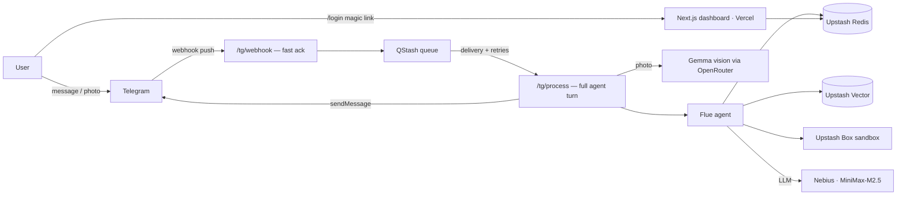

# Calorie Track Agent

A personal health agent that lives in Telegram. Text it what you ate — or send a photo of your plate — and it logs calories and macros, remembers your profile, corrects itself when you push back, and answers questions about your history. A companion web dashboard shows an Apple-Watch-style calorie calendar.

Calorie tracking is the first vertical; the architecture is built to extend into further health domains (biological age, scheduling, coaching).

## What it does

- **Log meals by text or photo.** "I had two eggs" or a photo of the plate → kcal + macro estimate, persisted per user.
- **Natural corrections.** "That was yesterday, not today" moves the meal and fixes both days' totals. "It's a lentil waffle, not a rice cake" edits in place — no delete-and-relog.
- **Conversational onboarding.** Age / height / weight / activity / allergies gathered chat-first; the daily kcal target is computed (Mifflin-St Jeor) or set explicitly.
- **Proactive feedback.** The agent asks "how did that meal feel?" some time after a log, and records the sentiment on the meal.
- **Assumption ledger.** Inferences the agent makes about you ("tends to skip breakfast") are stored with confidence levels, shown on the dashboard, and confirmable/rejectable.
- **Persistent memory.** Conversation history is stored in Redis, so it survives deploys and instance restarts.
- **A computer of its own.** For tasks no tool covers (compute a weekly average, parse a recipe URL), the agent spins up an ephemeral Linux sandbox (Upstash Box) and runs code.
- **Web dashboard.** Calorie calendar heatmap (deficit/surplus per day), daily progress ring, macro bars, meal log by day, profile + assumptions. Login via a one-time magic link the bot DMs you.

## Architecture



Two deployables, one shared database:

| Piece | Where | What |
|---|---|---|
| **Agent** (`.flue/`, `src/`) | Google Cloud Run, scale-to-zero | Flue server exposing the chat agent + Telegram webhook pipeline |
| **Dashboard** (`dashboard/`) | Vercel | Next.js app reading the same Upstash Redis directly |

The webhook → queue → processor split exists because Telegram requires a fast webhook ack (slow responses cause duplicate redeliveries) while an agent turn takes 5–60s, and Cloud Run's request-based billing only grants CPU *inside* a request. QStash bridges the two: the webhook acks in ~200ms and enqueues; QStash calls `/tg/process` as a fresh request in which the whole turn runs. Per-user turns are serialized with a Redis lock (busy → 429 → QStash redelivers). Idle = zero instances = zero cost.

## Stack

| Concern | Choice | Why |
|---|---|---|
| Agent harness | [Flue](https://flueframework.com) | Sessions with pluggable persistence, typed tool definitions, structured output enforcement, sandbox abstraction — without renting a hosted agent platform |
| LLM | MiniMax-M2.5 via [Nebius Token Factory](https://tokenfactory.nebius.com) | Fast, strong tool-calling, OpenAI-compatible; swappable in one line via Flue's provider registry |
| Vision | Gemma via OpenRouter (BYOK) | Photo → text description feeds the (text-only) main model; cheap and decoupled |
| State | Upstash Redis | Meal log, daily totals, profiles, assumptions, sessions, locks — all tenant-prefixed (`t:{telegramId}:*`) |
| Semantic recall | Upstash Vector | "Have I logged eggs this week?" — embeddings per tenant namespace |
| Agent compute | Upstash Box | Ephemeral per-turn Linux sandbox for `run_shell` / `run_code` tools |
| Channel | Telegram (webhook; [grammY](https://grammy.dev) for local dev) | Free, has photos/voice, and the Telegram user id doubles as the tenant key and the dashboard identity |
| Queue | Upstash QStash | Reliable delivery + retries between webhook ack and agent turn |
| Dashboard | Next.js on Vercel | Server-rendered reads of the shared Redis; zero-config deploys |

## Why TypeScript

1. **The harness decided it.** Flue is a TypeScript framework. Once it was chosen as the agent backbone, the language followed. (The original plan considered Python for Cognee's sake; Cognee was deferred, Flue was not.)
2. **One language, whole system.** Agent tools, webhook pipeline, Telegram integration, and the dashboard are all TS. For a small team that means one mental model, shared conventions, and no serialization seams between "agent land" and "app land".
3. **Types at the boundaries that bite.** Agent systems fail at boundaries: tool parameter schemas, LLM structured output, Redis record shapes. Here those are all typed and validated (TypeBox-style tool params, valibot result schemas, typed record mappers). A missing tool reference or a renamed field is a compile error, not a silent runtime failure mid-conversation.
4. **The ecosystem is TS-first.** grammY, the Upstash SDKs, Next.js, Hono — every dependency in this repo publishes first-class types.

One hard-won caveat lives in `tsconfig.flue.json`: the agent code in `.flue/` is outside the default `src/` include, and `flue build` tolerates unresolved names — so the repo typechecks **both** roots (`npm run typecheck`). Don't trust the bundler alone.

## Repository layout

```
.flue/
  agents/chat.ts      # the agent: system prompt + 12 tools (log/edit/query meals,
                      #   profile, feedback, assumptions, shell/code sandbox)
  app.ts              # HTTP surface: Telegram webhook pipeline + provider registry,
                      #   wraps Flue's app (Hono)
  lib/                # redis (data layer), vector, box, vision, sessionStore,
                      #   telegramApi, loginToken
src/                  # local-dev long-polling bot (grammY) — prod uses webhooks
dashboard/            # Next.js dashboard (Vercel) — own package.json
Dockerfile            # single-process container: node dist/server.mjs
deploy-cloudrun.sh    # deploy + `set-webhook` subcommand
```

## Running locally

```bash
npm install
cp .env.example .env   # fill in tokens (see below)
npm run dev            # flue dev server + long-polling bot
```

Requires: a Telegram bot token (@BotFather), Upstash Redis + Vector + Box + QStash credentials, a Nebius API key, an OpenRouter key for vision.

**Caveat:** if the production webhook is registered, Telegram sends no updates to a long-poller. Delete the webhook while developing, restore it after:

```bash
curl "https://api.telegram.org/bot$TELEGRAM_BOT_TOKEN/deleteWebhook"
# ...develop...
./deploy-cloudrun.sh set-webhook
```

For the dashboard: `cd dashboard && cp .env.example .env.local && npm install && npm run dev` (a dev-only login bypass exists at `/api/auth/dev?id=<telegramId>`; production auth is the bot's `/login` magic link).

## Deploying

**Agent → Cloud Run** (scale-to-zero):

```bash
gcloud auth login && gcloud config set project <project>
./deploy-cloudrun.sh              # build + deploy
./deploy-cloudrun.sh set-webhook  # first time / after secret change
```

**Dashboard → Vercel:** import the repo, set **Root Directory = `dashboard`**, add the env vars, deploy. Then register the domain with @BotFather (`/setdomain`) if you want the Telegram Login Widget in addition to magic links.

## Cost profile

Idle cost is zero (scale-to-zero). Light usage sits inside Cloud Run's request-based free tier and Upstash/Vercel free tiers; the paid LLM is a few cents per hundred turns. The dominant design constraint throughout was: *an agent that costs nothing while nobody is talking to it.*

## Roadmap

- Voice-message logging (transcription → same pipeline)
- Subscription tiers (Stripe) + usage quotas
- Further health domains: biological age, calendar/scheduling, coaching loops
